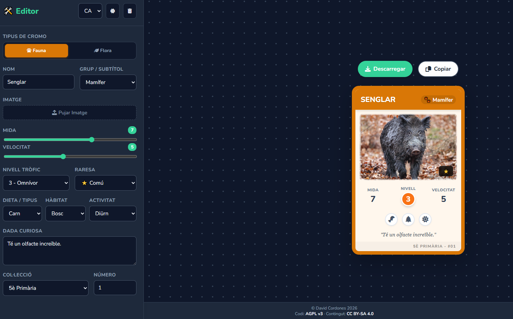

# 🌿 Eco-Duel: Generador de Cromos Educatius


Una aplicació web interactiva dissenyada per a l'aula, que permet als alumnes crear cromos personalitzats de flora i fauna. Aquesta eina fomenta la **gamificació** en l'aprenentatge de les Ciències Naturals.



## 🚀 Característiques Principals

* **🎨 Disseny Modern:** Estil "Glassmorphism" net i atractiu visualment.
* **🌙 Mode Clar/Fosc:** Detecta automàticament la preferència del sistema i inclou un selector manual.
* **🌍 Multi-idioma:** Traducció instantània a Català, Castellà i Anglès (i18n).
* **📸 Generació d'Imatges:** Permet **descarregar** el cromo en PNG d'alta qualitat o **copiar-lo** al porta-retalls per enganxar-lo a Google Slides/Docs.
* **🦁 Tipus Dinàmics:** Canvia automàticament els camps i colors segons si és "Fauna" o "Flora".
* **📊 Estadístiques Visuals:** Sliders per a Mida i Velocitat/Dispersió, i selectors visuals per al Nivell Tròfic.

## 🛠️ Tecnologies Utilitzades

Aquest projecte s'ha desenvolupat utilitzant tecnologies web estàndard, sense necessitat de frameworks complexos ni instal·lacions pesades:

* **HTML5:** Estructura semàntica.
* **CSS3:** Variables CSS (Custom Properties), Flexbox, Grid i Disseny Responsive.
* **JavaScript (ES6+):** Lògica del DOM, gestió de l'estat i internacionalització.
* **Llibreries Externes:**
    * [FontAwesome](https://fontawesome.com): Icones vectorials.
    * [Google Fonts (Nunito)](https://fonts.google.com): Tipografia.
    * [html2canvas](https://html2canvas.hertzen.com/): Per convertir el disseny HTML en imatge descarregable.

## 📦 Instal·lació i Ús

No cal instal·lar res! Aquesta aplicació s'executa directament al navegador.

1.  **Descarrega** el codi o clona aquest repositori:
    ```bash
    git clone [https://github.com/TEU-USUARI/eco-duel.git](https://github.com/TEU-USUARI/eco-duel.git)
    ```
2.  Obre l'arxiu `index.html` amb el teu navegador web preferit (Chrome, Firefox, Edge, Safari).
3.  Comença a crear els teus cromos!

## 📂 Estructura del Projecte

```text
/
├── index.html      # L'estructura de la pàgina
├── style.css       # Els estils visuals (colors, disseny)
├── app.js          # La lògica (traduccions, descàrrega, interactivitat)
├── LICENSE.txt     # La llicència completa AGPL v3
└── README.md       # Aquest document
